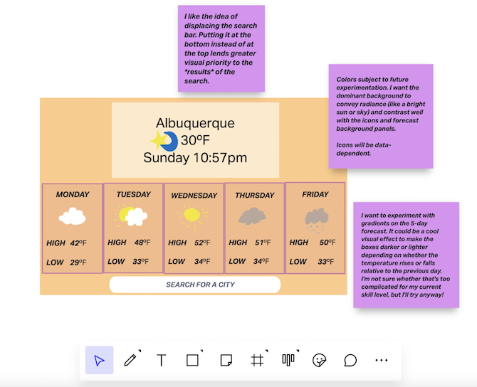
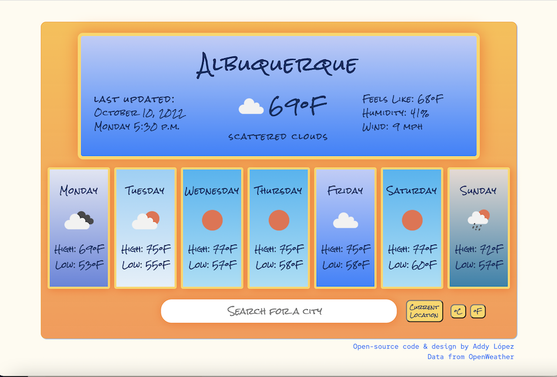

# Weather Application

**_View this project:_** [https://goofy-edison-1b09a8.netlify.app/](https://goofy-edison-1b09a8.netlify.app/)

## Description

Submitted as my final student project for the coding workshop SheCodes Plus and completed only about three months after starting my coding journey (with zero prior knowledge--my second project ever!).

This project is a dynamic weather application integrated the [OpenWeatherMap API](https://openweathermap.org/api). It is a dashboard capable of displaying weather data--including the current weather and the week's forecast, among other meteorological details--for over 200,000 cities around the world. I built this application with HTML, CSS, new Bootstrap techniques, and vanilla JavaScript while following a professional workflow that began with a wireframe (included below) and also integrated GitHub and the hosting platform Netlify for the continuous deployment of my code.

The display includes: full date and time of the last update; city name, current temperature, weather description, weather icon, humidity, wind speed, "feels like" temperature; the forecast, starting with the current day in the first column and continuing for six more columns that provide the high and low temperatures, accessorized with appropriate icons, for the rest of the week; a search engine, a current location button, and unit conversion buttons.

## Coding Features

#### HTML:

    - Elements: h1, ul, li, p, form, input, img, div, span,  button, br, script, link, meta, title

    - Attributes: class, id, href, alt, src, rel, target, title, type, placeholder, autofocus, autocomplete, description

    - Imported custom font from Google Fonts

    - Imported external stylesheets for CSS and Bootstrap CSS and external JavaScript file to respect the Single Responsibility Principle (or the separation of concerns)

---

#### CSS:

    - Properties: background (with linear gradient) background-color, border, border-radius, box-shadow, color, display, font-family, font-size, font-weight, letter-spacing, line-height, list-style, margin, max-height, max-width, padding, position, left, right, top, text-align, text-decoration, text-transform, width

    - Class selectors and pseudo-selectors (hover effects for heightened interactivity)

    - Bootstrap grid

---

#### JavaScript:

    - Functions, variables, arrays, parameters, conditional statements (if, if/else), string interpolation with template literals, string concatenation, identity operator, logical operators, comparison operators, dot operator, ID selection/targeting, multiplication, division, subtraction, truthy values, bracket notation

    - Methods: document.querySelector(), document.querySelectorAll(), Math.round(), .innerHTML, .get(), .then(), .getCurrentPosition() (the in-built Geolocation API), .addEventListener()  (with click events), .reset() , .preventDefault() , .setAttribute() , .new Date() , .getFullYear, .getMonth(), .getDate(), .getDay() , .getHours() , .getMinutes() , alert(), .forEach() loops

    - Sophisticated manipulation of global and block scope

    - OpenWeatherMap API integration using AJAX / Axios

    - Clear, descriptive names straightforwardly indicating the purpose of each function

    - Extensive debugging with console.log() method

---

#### Accessibility, attribution, and workflow:

    - Accessibility rating by Lighthouse audit: 100/100 for desktop; 100/100 for mobile devices

    - Proper attribution for the data is included directly beneath the display to boost the credibility of the application and to show a conscientious ethos of transparency in the public presentation of data online

    - Wireframe prototyping with InVision Freehand prior to coding (see below)

    - Coded in VS Code with tools for a professional development workflow and continuous deployment, such as Live Server, GitHub, and hosting on Netlify

    - GitHub repo includes this polished README using Markdown

## Special Features

- One special feature that I want to call attention to is the _dynamic, data-dependent colors_ that I designed for the display. Notice that the search results yield different background colors, based on meteorological conditions, that visually enhance the feel for the character of that day's weather. Many utilitarian weather apps saturate the eye with numerical figures without visually appealing to our intuitive sense for how the days of the week will look and feel, as, for instance, when we look out the window at the sky to decide what to wear. As a corrective, I experimented of my own initiative with the techniques I had learned and implemented a form of conditional rendering by creating what I understand now is essentially a mapping between the icon codes and the background colors. This was achieved by assigning my CSS selectors, Bootstrap's grid classes, and unique indexical labels from my JavaScript file using the .setAttribute() method.

- Another deceptively simple feature to notice is the _buttons_ I programmed.

  - The first button triggers a geolocation function that will retrieve weather data based on the geographic coordinates of the user's device and update the entire display to reflect those data without refreshing the page.

  - The other two buttons will convert all data from Fahrenheit (imperial units) to Celsius (metric units) or vice versa as many times as desired and without introducing errors. I am especially proud of figuring out this solution on my own in vanilla JavaScript, since our instructor believed that the conversion would introduce too much complexity into the assignment and did not show us students how to code this feature. Furthermore, he said that we would likely need to use React (e.g. React state management) to update the data dynamically on the page without refreshing the page.

- Finally, I want to draw attention to my configuration of the date and time. In JavaScript, I converted the months and days from numbers to their proper names to improve the legibility of the UI. Trickier still, however, was that I independently decided without instruction to convert the twenty-four-hour timestamp to a twelve-hour clock, the proper formatting of which required a lot of precision in accounting for every possible outcome. After subjecting this feature to extensive testing and debugging, I am proud that each datum at any part of the day or night is error-free. I tested the results of my code not only for accuracy but also with the layout of the text in mind so that the longer string lengths would not initiate a new line that altered the spacing of the main display.

## Wireframe

Planning for this application began with a wireframe prototype using the whiteboarding service [InVision Freehand](https://www.invisionapp.com/freehand) in order to imitate a process of professional product design prior to coding. The purple sticky notes provide explanatory details and outline experimental features I wanted to build.

## Project Preview

